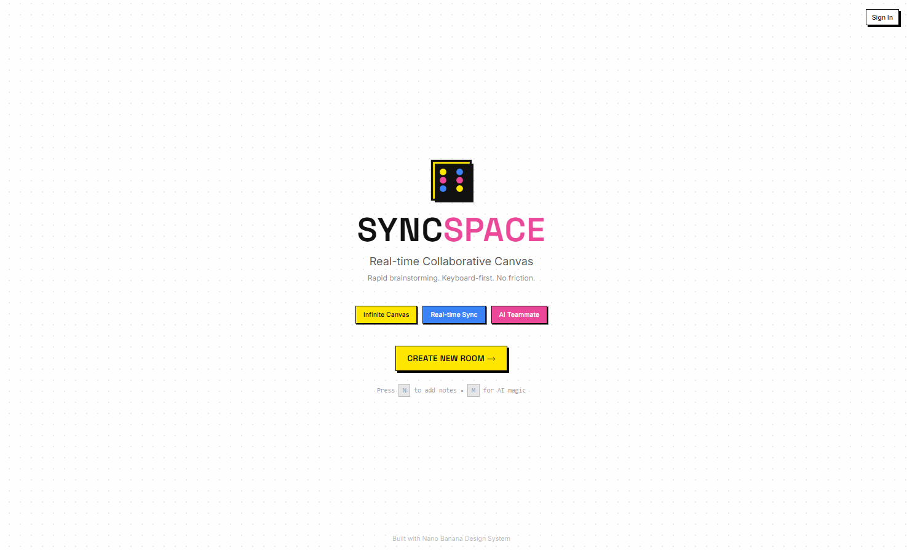

<div align="center">

# ✨ SyncSpace

**Real-time Collaborative Canvas for Rapid Brainstorming**

[](https://nextjs.org/)
[](https://react.dev/)
[](https://www.typescriptlang.org/)
[](https://liveblocks.io/)
[](https://supabase.com/)

[Live Demo](https://syncspace-app.vercel.app) · [Report Bug](https://github.com/Salvero/SyncSpace/issues)

</div>

---

## 📸 Screenshots

### Homepage


### Collaborative Canvas


---

## 🚀 Features

| Feature | Description |
|---------|-------------|
| 🎨 **Infinite Canvas** | Zoom, pan, and organize ideas freely on an unlimited workspace |
| ⚡ **Real-time Sync** | Collaborate with teammates instantly via Liveblocks |
| 🤖 **AI Teammate** | Generate related ideas with Gemini AI (press `M` for magic!) |
| 🎯 **Keyboard-first** | Speed-optimized shortcuts for power users |
| 🔗 **Smart Connections** | Link notes with smooth bezier curves |
| 👥 **Live Cursors** | See collaborators' cursors in real-time |
| ↩️ **Undo/Redo** | Full history support with `Ctrl+Z` / `Ctrl+Shift+Z` |
| 📋 **Note Templates** | Quick-start with Idea, Question, or Task templates |
| 📱 **Mobile Responsive** | Works on desktop, tablet, and mobile |
| 🔒 **Secure** | Row Level Security with Supabase |

---

## ⌨️ Keyboard Shortcuts

| Shortcut | Action |
|----------|--------|
| `N` | Create new note |
| `M` | AI Magic - Generate related ideas |
| `Delete` / `Backspace` | Delete selected note |
| `Ctrl + Z` | Undo |
| `Ctrl + Shift + Z` | Redo |
| `Ctrl + C` | Copy note |
| `Ctrl + V` | Paste note |

---

## 🛠️ Tech Stack

- **Framework:** [Next.js 16](https://nextjs.org/) with App Router & Turbopack
- **UI:** [React 19](https://react.dev/) + [Tailwind CSS 4](https://tailwindcss.com/)
- **Canvas:** [React Flow](https://reactflow.dev/) for node-based interactions
- **Real-time:** [Liveblocks](https://liveblocks.io/) + [Yjs](https://yjs.dev/) for CRDT sync
- **AI:** [Google Gemini](https://ai.google.dev/) via Vercel AI SDK
- **Auth & DB:** [Supabase](https://supabase.com/) with Row Level Security
- **State:** [Zustand](https://zustand-demo.pmnd.rs/) for local state management
- **Deployment:** [Vercel](https://vercel.com/)

---

## 📦 Getting Started

### Prerequisites

- Node.js 20+
- npm, yarn, pnpm, or bun

### Installation

```bash
# Clone the repository
git clone https://github.com/Salvero/SyncSpace.git
cd SyncSpace/syncspace-app

# Install dependencies
npm install

# Copy environment variables
cp .env.example .env.local

# Start development server
npm run dev
```

Open [http://localhost:3000](http://localhost:3000) to see the app.

---

## 🚀 Deployment

### Deploy to Vercel

[](https://vercel.com/new/clone?repository-url=https://github.com/Salvero/SyncSpace)

1. Click the button above or run:
   ```bash
   vercel
   ```

2. Add environment variables in Vercel Dashboard

3. Deploy!

---

## 🔒 Security

- **Rate Limiting:** AI endpoint limited to 10 requests/minute per IP
- **Row Level Security:** Supabase tables protected with RLS policies
- **Auth:** Secure authentication via Supabase

---

## 📄 License

MIT License - feel free to use this project for your own purposes.

---

<div align="center">

**Built with 💛 using Nano Banana Design System**

Made by [Salvero](https://github.com/Salvero)

</div>
